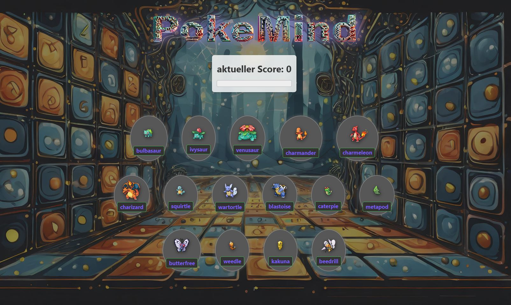

# Pokemind


<a href="https://github.com/Marco-Jan/PokeMind/">
    
  </a>

Pokemind ist ein interaktives Pokémon-Spiel, bei dem es darum geht, sich an bereits angeklickte Pokémon zu erinnern. Ziel ist es, so viele einzigartige Pokémon wie möglich anzuklicken, ohne ein bereits geklicktes Pokémon erneut auszuwählen. Das Spiel bietet eine einfache, aber fesselnde Benutzeroberfläche und ist eine unterhaltsame Möglichkeit, dein Gedächtnis zu testen!

## Inhaltsverzeichnis

- [Technologien](#technologien)
- [Installation](#installation)
- [Verwendung](#verwendung)
- [Komponenten](#komponenten)
- [Lizenz](#lizenz)

## Technologien

- **React**: Für die Benutzeroberfläche und den Komponentenaufbau.
- **TypeScript**: Für Typisierung und Robustheit des Codes.
- **CSS**: Für Styling der Komponenten.
- **PokeAPI**: Zur Abrufung von Pokémon-Daten.

## Installation

1. **Repository klonen:**

```bash
   git clone https://github.com/deinbenutzername/pokemind.git
   cd pokemind
```

2. **Abhängigkeiten installieren und initialisieren:**

```bash
    npm install
    npm init
```
2. **Entwicklungsserver starten:**

```bash
    npm run dev
    Das Projekt wird auf http://localhost:5173 verfügbar sein.
```

## Verwendung

Beim Starten der App wird eine Liste von Pokémon angezeigt. Dein Ziel ist es, auf die Pokémon zu klicken, ohne bereits ausgewählte Pokémon erneut anzuklicken. Bei jedem erfolgreichen Klick wird dein Punktestand erhöht. Wenn du ein bereits ausgewähltes Pokémon erneut auswählst, wird das Spiel zurückgesetzt, und dein Punktestand wird auf null zurückgesetzt.

## Komponenten

- **`App`**: Die Hauptkomponente, die die grundlegenden Layout-Komponenten (`Header`, `CardListContainer`, `Background`) zusammenfügt.

- **`CardListContainer`**: Verwaltet den Zustand des Spiels, einschließlich Punktzahl, Auswahl der Bilder und Interaktion mit der PokeAPI. Stellt die `CardList`-Komponente bereit und zeigt Toast-Nachrichten an.

- **`CardList`**: Zeigt die Pokémon-Karten an und ermöglicht das Klicken auf diese. Verwaltet visuelle Hinweise wie die Hervorhebung von bereits ausgewählten Pokémon.

- **`Score`**: Zeigt den aktuellen Punktestand und den Fortschritt im Vergleich zum Highscore an.

- **`Toast`**: Zeigt temporäre Nachrichten zur Benutzerinteraktion an, z.B. wenn ein bereits ausgewähltes Pokémon erneut angeklickt wird.

## Lizenz

Dieses Projekt ist unter der MIT-Lizenz lizenziert – siehe die [LICENSE](LICENSE) Datei für Details.
